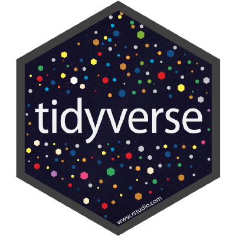

```{r setup, include=FALSE}
knitr::opts_chunk$set(
  comment = "#>",
  fig.align = "centre",
  warning = FALSE,
  error = FALSE)
```

## Who is everyone?

Instructor: Simon Jackson

- Was a cognitive psychologist in Australia
- Is a Lead Data Scientist at [Booking.com](https://www.booking.com/)
- [\@drsimonj](https://twitter.com/drsimonj) on Twitter

How about the people (helpers/helpees) around you?

## What is the Tidyverse?

> "The tidyverse is an opinionated collection of R packages designed for data science. All packages share an underlying philosophy and common APIs." [tidyverse.org](https://www.tidyverse.org/)



## Tidyverse is a collection of R packages

- A collection of open-source R packages for data science like `ggplot2` and `dplyr`.
- Developed and maintained by RStudio team and R community
- Can all be installed and managed with the `tidyverse` package:

```{r, eval = F}
# Installs all Tidyverse packages
install.packages("tidyverse")

# Attaches core* packages
library(tidyverse)
```
## Tidyverse packages share conventions

Why do we need opinionated packages with a shared philosophy and common APIs?

- Increase efficiency
    - Structures our workflow and thinking in a good way.
    - Glues our tasks together.

From [R for Data Science](http://r4ds.had.co.nz/explore-intro.html):


## What will I learn?

*Assuming I already know R basics*

- How to explore and wrangle data (mostly in data frames) with Tidyverse packages
- How to repeat yourself efficiently
- How the Tidyverse can help to solve real problems (using simulated data)

## Can I get the material?

All material is on GitLab at:

- [gitlab.booking.com/sjackson/tidyverse-workshop](https://gitlab.booking.com/sjackson/tidyverse-workshop)

Or via shortcut:

- [go/tidyverse](http://go/tidyverse)
