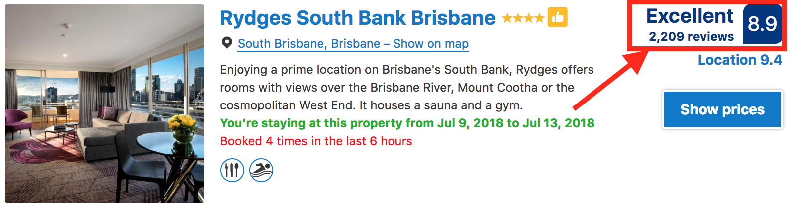
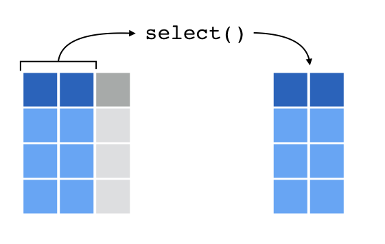
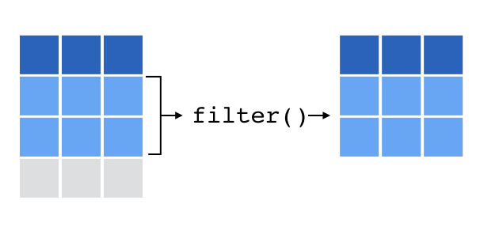

```{r setup, include=FALSE}
knitr::opts_chunk$set(
  comment = "#>",
  fig.align = "centre",
  fig.height = 4,
  message = FALSE,
  warning = FALSE,
  error = FALSE)

options(tibble.print_max = 5, tibble.print_min = 5)
```

## Our goal

At Booking.com, we want to understand the ingredients of a great travel experience.

We're going to explore data* about customer bookings and properties to try and understand the drivers of customer review scores.

```{r, out.width = "800px", echo = FALSE}

```

*Data is simulated

## Setup

Let's dive straight in and Tidyverse our way from importing to visualising data.

Start a new R Project, create an R script, and load the tidyverse package

```{r}
library(tidyverse)
```

# Importing Data

## Our data

We have two data sets stored as .csv files

`bookings.csv` and `properties.csv`

## [readr](http://readr.tidyverse.org/) for rectangular files

```{r, eval = F}
# Example from local file
bookings <- read_csv("data/bookings.csv")
```
```{r, eval = F}
# Example from URL
# d <- read_csv("https://gitlab.booking.com/
#               sjackson/tidyverse-workshop/raw/master/
#               data/workshop_data_1.csv")
```
```{r, include = F}
# Run for internal use (not shown on slides)
bookings <- read_csv("../data/bookings.csv")
```
```{r}
bookings
```

## [readr](http://readr.tidyverse.org/) for rectangular files

```{r, eval = F}
properties <- read_csv("data/properties.csv")
```
```{r, include = F}
# Run for internal use (not shown on slides)
properties <- read_csv("../data/properties.csv")
```
```{r}
properties
```

# [tibble](http://tibble.tidyverse.org/)

## tibbles are modern data frames

```{r}
class(bookings)
bookings
```

# [dplyr](http://dplyr.tidyverse.org/)

## Common API structure

- Functions are verbs signalling action
- First argument is a data frame
- Returns a data frame (mostly)
- Subsequent arguments reference columns and do not require the use of quotation marks

## `select` columns

```{r, out.width = "600px", echo = FALSE}

```

## `select` columns

```{r}
select(bookings, review_score)
```

## `select` columns

```{r}
select(bookings, review_score, status)
```

## `select` columns

```{r}
select(bookings, -booker_id)
```

## `filter` rows

```{r, out.width = "600px", echo = FALSE}

```

## `filter` rows

```{r}
filter(bookings, status == "stayed")
```

## `filter` rows

```{r}
filter(bookings, status == "stayed" & is.na(review_score))
```

## Test Yourself

Create a **NEW** tibble (data frame) including `room_nights` and `review_score` for bookings that cost less than <insert_currency>80 per night.

**DO NOT overwrite `bookings` in the process **

# [magrittr](http://magrittr.tidyverse.org/)

## magrittr and the pipe

One of the tell-tale signs of tidyverse code is the use of magrittr's pipe operator:

>` %>% `

## The pipe %>%

`f(x, y)`

is the same as

`x %>% f(y)`

## The pipe %>%

```{r}
c(1, 2, 3)  %>% sum()
c(1, 2, NA) %>% sum(na.rm = TRUE)
bookings %>% head(2)
```

## pipe for people

```{r}
head(
  select(
    filter(
      bookings, price_per_night < 80
    ),
    room_nights, review_score
  ),
  2
)
```

## pipe for people

```{r}
x <- filter(bookings, price_per_night < 80)
x <- select(bookings, room_nights, review_score)
head(x, 2)
```

## pipe for people

```{r}
bookings %>% 
  filter(price_per_night < 80) %>% 
  select(room_nights, review_score) %>% 
  head(2)
```

## Test Yourself

Write a data pipeline to get a tibble of the `property_id` and `status` of all bookings made on a Wednesday.

# [ggplot2](http://ggplot2.tidyverse.org/)

## A seriously powerful plotting package

- API involves building a plot in layers
- Must start with `ggplot()`
- Data must be in a data.frame (or tibble)
- Visual elements representing data (points, lines, etc) are "geoms"
- Geom appearance (position, color, etc) is defined by aesthetics

## Histogram

```{r, message = F}
ggplot(bookings, aes(x = review_score)) +
    geom_histogram()
```

## Scatter plot

```{r}
bookings %>% 
  ggplot(aes(x = price_per_night, y = review_score)) +
    geom_point()
```

# Bringing it together

## Challenge

Did you know ggplot2 objects store the entire data frame you provide it? This can create a lot of overhead!

**In a single data pipeline** (using %>%), create a scatter plot of price per night against review score for stayed bookings lasting a week or more. Provide ggplot with a data frame of only the required data (columns and rows).

## Answer part 1

```{r}
bookings %>%
  filter(room_nights >= 7, status == "stayed")
```

## Answer part 2

```{r, fig.height=3}
bookings %>%
  filter(room_nights >= 7, status == "stayed") %>%
  select(price_per_night, review_score)
```

## Answer part 3

```{r, fig.height=3}
bookings %>%
  filter(room_nights >= 7, status == "stayed") %>%
  select(price_per_night, review_score) %>%
  ggplot(aes(price_per_night, review_score)) +
    geom_point()
```

## What we covered

We seamlessly integrated 5 tidyverse packages, in a human-readable way, to import, transform, and visualise data!

```{r, out.width = "800px", echo = FALSE}
knitr::include_graphics("../images/data-science-workflow.png")
```

*Image from [R for Data Science](http://r4ds.had.co.nz/explore-intro.html)
