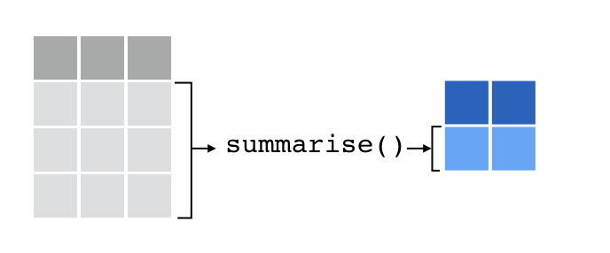
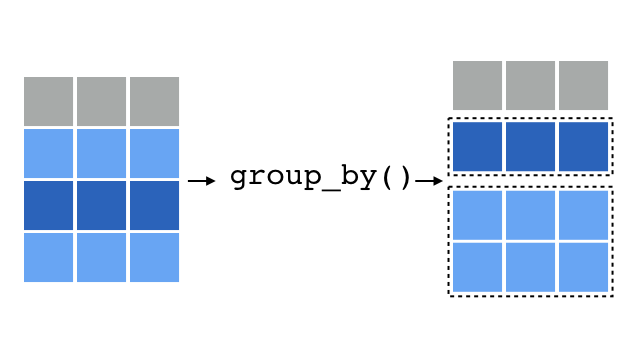

```{r setup, include=FALSE}
knitr::opts_chunk$set(
  comment = "#>",
  fig.align = "centre",
  fig.height = 4,
  message = FALSE,
  warning = FALSE,
  error = FALSE)

options(tibble.print_max = 5, tibble.print_min = 5)
```

## Setup

- Load the tidyverse
- Import the `bookings` and `properties` data sets
- Love the Data Transformation [cheatsheet](https://www.rstudio.com/resources/cheatsheets/)

```{r, eval = F}
library(tidyverse)
bookings   <- read_csv("data/bookings.csv")
properties <- read_csv("data/properties.csv")
```
```{r, include = F}
# Run for internal use (not shown on slides)
library(tidyverse)
bookings   <- read_csv("../data/bookings.csv")
properties <- read_csv("../data/properties.csv")
```

# Recap

## `select` columns and `filter` rows

```{r}
bookings %>%
  select(booker_id, room_nights) %>% 
  filter(room_nights > 7)
```

# mutate()

## `mutate` old and new columns

```{r}
bookings %>%
  mutate(total_price = price_per_night * room_nights)
```

## `mutate` old and new columns

```{r}
bookings %>%
  mutate(property_id = as.factor(property_id))
```

## Test Yourself

Add a new column to your data set: mean-centered price_per_night

## Answer

```{r}
bookings %>% 
  mutate(centered_ppn = price_per_night - mean(price_per_night))
```

# summarise()

## `summarise` many rows

```{r, out.width = "600px", echo = FALSE}

```

## `summarise` many rows

`summarise` takes many rows as input, and returns one row.

```{r}
bookings %>%
  summarise(review_score = mean(review_score, na.rm = TRUE))
```

## `summarise` many rows

```{r}
bookings %>%
  summarise(
    n = n(),
    n_miss = sum(is.na(review_score)),
    review_score = mean(review_score, na.rm = TRUE)
  )
```

## Test Yourself

Obtain a one-row summary data frame of the `bookings` data:

- The number of rows
- The number of stayed bookings
- The mean of the *total* price

## Answer

```{r}
bookings %>% 
  mutate(total_price = price_per_night * room_nights) %>% 
  summarise(
    n          = n(),
    n_stayed   = sum(status == "stayed"),
    mean_price = mean(total_price)
  )
```

# group_by()

## Business travelers v tourists

```{r, out.width = "650px", echo = FALSE}

```

## `group_by` and then...

```{r, out.width = "600px", echo = FALSE}

```

## `group_by` and then...

`group_by` makes a change under the hood so dplyr functions run separately for each group.

```{r}
class(bookings)
bookings_by_type <- bookings %>%
  group_by(for_business)

class(bookings_by_type)
```

## `group_by` and then...

```{r}
bookings %>% 
  group_by(for_business) %>% 
  summarise(
    n = n(),
    review_mean = mean(review_score, na.rm = TRUE)
  )
```

## `group_by` and then...

What's happening here?

```{r, eval = FALSE}
bookings %>% 
  group_by(for_business) %>% 
  mutate(centered_review = review_score - mean(review_score, na.rm = TRUE))
```

## `group_by` and then...

```{r, fig.height=3}
bookings %>% 
  group_by(for_business) %>% 
  mutate(centered_review = review_score - mean(review_score, na.rm = TRUE)) %>% 
  ggplot(aes(centered_review, fill = for_business)) +
    geom_histogram(position = "identity", alpha = .2)
```

## Test Yourself

Reduce the data set to only include the most expensive booking of each property.

You should get as many rows as there are unique properties:

```{r}
n_distinct(bookings$property_id)
```

## Answer

```{r}
bookings %>% 
  mutate(price_total = price_per_night * room_nights) %>% 
  group_by(property_id) %>% 
  filter(price_total == max(price_total))
```

## `group_by` and then...

We can also `group_by` multiple discrete variables:

```{r}
bookings %>% 
  group_by(for_business, checkin_day) %>% 
  summarise(mean_review = mean(review_score, na.rm = TRUE))
```

## Bonus: `count()`

```{r, eval = F}
bookings %>%
  count(x, y, ...)
```

is a (sort of) shortcut for 

```{r, eval = F}
bookings %>%
  group_by(x, y, ...) %>% 
  summarise(n = n())
```

## Bonus: `count()`

```{r}
bookings %>% 
  count(for_business, status)
```


## `*_join` tables together

```{r}
bookings %>% 
  left_join(properties)
```

## `*_join` tables together

There are options!

- `inner_join()`
- `left_join()`
- `right_join()`
- `full_join()`
- `semi_join()`
- `anti_join()`
