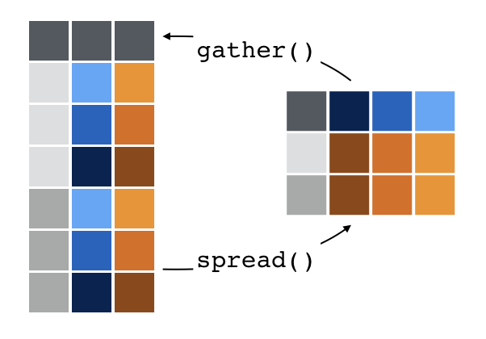

```{r setup, include=FALSE}
knitr::opts_chunk$set(
  comment = "#>",
  fig.align = "centre",
  fig.height = 4,
  message = FALSE,
  warning = FALSE,
  error = FALSE)

options(tibble.print_max = 5, tibble.print_min = 5)
```

## Setup

- Load the tidyverse
- Import the `bookings` and `properties` data sets
- Full-join data sets as a tibble called `d`
- Love the Data Import [cheatsheet](https://www.rstudio.com/resources/cheatsheets/)

```{r, eval = F}
library(tidyverse)
bookings   <- read_csv("data/bookings.csv")
properties <- read_csv("data/properties.csv")
d <- bookings %>% full_join(properties)
```
```{r, include = F}
# Run for internal use (not shown on slides)
library(tidyverse)
bookings   <- read_csv("../data/bookings.csv")
properties <- read_csv("../data/properties.csv")
d <- bookings %>% full_join(properties)
```

# Handling Missing Values

## `drop_na` cases

```{r}
# Drop any rows with a missing value
d %>% drop_na()
```

## `drop_na` cases

```{r}
# Drop rows with missing values on certain variables
d %>% drop_na(review_score)
```

# Reshaping data

## Quick data munge

Let's investigate the distribution of check in days per destination.

```{r}
day_order <- c("sun", "mon", "tue", "wed", "thu", "fri", "sat")

checkin_count <- d %>%
  count(destination, checkin_day) %>% 
  mutate(checkin_day = factor(checkin_day, levels = day_order))
checkin_count
```

## Thought experiment

How would you create this table?

```{r, echo = F}
checkin_count %>% 
  spread(checkin_day, n)
```

## `gather` and `spread`

```{r, out.width = "600px", echo = FALSE}

```

## `spread` key-value pairs to many columns

```{r}
wide_checkin_count <- checkin_count %>% 
  spread(checkin_day, n)

wide_checkin_count
```

## What about the other way?

From `wide_checkin_count` to `checkin_count` ?

## `gather` many columns to a key-value pair

```{r}
wide_checkin_count %>% 
  gather(day, n, sun, mon, tue, wed, thu, fri, sat)
```

# Challenge

## Challenge

Do properties appeal to business-traveller and tourists alike?

For each property, calculate the average review score given by business bookers and tourists.

Plot these against each other in a scatter/point plot.

## Answer part 1

Average review score of each property for business bookers and tourists:

```{r}
review_by_type <- d %>%
  group_by(property_id, for_business) %>%
  summarise(review_score = mean(review_score, na.rm = TRUE))

review_by_type
```

## Answer part 2

Spread into columns to plot against each other. Relabelling is optional but makes life easier.

```{r}
wide_reviews <- review_by_type %>% 
  mutate(for_business = if_else(for_business, "business", "tourist")) %>% 
  spread(for_business, review_score)

wide_reviews
```

## Answer part 3

The plot

```{r, fig.height = 3, fig.width = 5}
wide_reviews %>% 
  ggplot(aes(tourist, business)) +
    geom_point()
```

