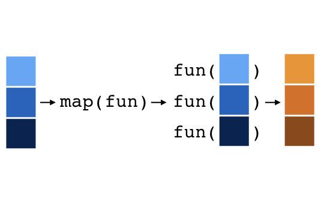

```{r setup, include=FALSE}
knitr::opts_chunk$set(
  comment = "#>",
  fig.align = "centre",
  fig.height = 4,
  message = FALSE,
  warning = FALSE,
  error = FALSE)

options(tibble.print_max = 5, tibble.print_min = 5)
```

## Setup

- Load the tidyverse
- Import the `bookings` and `properties` data sets
- Love the Apply Functions [cheatsheet](https://www.rstudio.com/resources/cheatsheets/)

```{r, eval = F}
library(tidyverse)
bookings   <- read_csv("data/bookings.csv")
properties <- read_csv("data/properties.csv")
```
```{r, include = F}
# Run for internal use (not shown on slides)
library(tidyverse)
bookings   <- read_csv("../data/bookings.csv")
properties <- read_csv("../data/properties.csv")
```

## Thought Experiment

How to hash encode property IDs using `digest()` from the digest package?

For example, to do this for every property ID:

```{r}
library(digest)
digest(1023)
```

## The problem

`digest()` is not vectorized

```{r}
properties %>% 
  mutate(property_id = digest(property_id))
```

## A for loop?

We could write a for loop

```{r}
hashes <- c()
for (id in properties$property_id) {
  hashes <- c(hashes, digest(id))
}

# Then use `hashes` in mutate
hashes
```

## But loops are slow?

Loops are slow *when memory is not pre-allocated*

This is much better:

```{r}
n <- nrow(properties)
hashes <- character(length = n)
for (i in seq_len(n)) {
  hashes[i] <- digest(properties$property_id[i])
}
hashes
```

## Proof?

```{r}
n <- 50000
x_empty <- c()
x_alloc <- integer(length = n)
```
```{r}
system.time(
  for (i in seq_len(n)) x_empty <- c(x_empty, i)
)

system.time(
  for (i in seq_len(n)) x_alloc[i] <- i
)
```

# [purrr](http://purrr.tidyverse.org/)

## Meet the `map` functions

purrr's `map` functions:

- Iterate through each element of a vector or list
- Applies a function to each element
- Return something for each iteration

Bonus:

- Predictable output
- Handles nasty pre-allocation issues

## Meet the `map` functions

```{r, out.width = "600px", echo = FALSE}

```

## Start general: anonymous functions

First argument is a vector/list. Declare anything to apply to each element by starting with `~`, and using `.` to represent the element.

```{r}
x <- c(1, 2, 3)
map(x, ~ . + 1)
```

## Start general: anonymous functions

```{r}
map(x, ~ digest(.))
```

## Changing the output

`map()` returns a list. Use `map_*()` for specific vectors:

```{r}
map_dbl(x, ~ . * 0.5)
map_lgl(x, ~ . == 2)
map_chr(x, ~ digest(.))
```

## Shortcuts

Just name function and additional args when `.` is first argument.

```{r, eval = F}
map_chr(x, ~ digest(., algo = "sha1"))
```

Can be written:

```{r}
map_chr(x, digest, algo = "sha1")
```

## Shortcuts

Character to extract a named element.

```{r}
l <- list(c(a = 1L, b = 2L), c(a = 3L, b = 4L))
```
```{r, eval = F}
map_int(l, ~ .[["a"]])
```

Can be written:

```{r}
map_int(l, "a")
```

## Shortcuts

Integer to extract element by position.

```{r, eval = F}
map(l, ~ .[[2]])
```

Can be written:

```{r}
map(l, 2)
```

## Test Yourself

Use a map function and `digest()` to hash encode the property IDs.

## Answer

```{r}
properties %>% 
  mutate(property_id = map_chr(property_id, digest))
```
