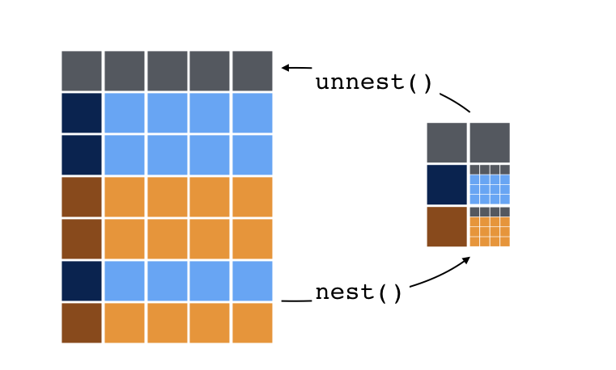

```{r setup, include=FALSE}
knitr::opts_chunk$set(
  comment = "#>",
  fig.align = "centre",
  fig.height = 4,
  message = FALSE,
  warning = FALSE,
  error = FALSE)

options(tibble.print_max = 5, tibble.print_min = 5)
```

## Setup

- Load the tidyverse
- Import the `bookings` and `properties` data sets
- Full join them as `d`

```{r, eval = F}
library(tidyverse)
bookings   <- read_csv("data/bookings.csv")
properties <- read_csv("data/properties.csv")
d <- bookings %>% full_join(properties)
```
```{r, include = F}
# Run for internal use (not shown on slides)
library(tidyverse)
bookings   <- read_csv("../data/bookings.csv")
properties <- read_csv("../data/properties.csv")
```

## Why combine iteration and data frames?

When we can't vectorize our task.

To keep things together.

# List columns

## Example

R data frames can have a `"list"` for a column, which are nicely printed by tibbles.

```{r}
properties <- properties %>% 
  mutate(facilities = strsplit(facilities, ","))

properties %>%
  select(property_id, facilities)
```

## Example

Remember that lists can store collections of different objects

```{r}
list(1, c("a", "b"), function(i){i + i}, matrix(1:4, nrow = 2))
```

## Test yourself

Now `facilities` is a list-col, add a column to `properties` that contains the number of facilities (`n_facilities`) per property.

The setup (in case you missed it):

```{r, eval = F}
properties <- properties %>% 
  mutate(facilities = strsplit(facilities, ","))
```

## Answer

```{r}
properties <- properties %>% 
  mutate(n_facilities = map_int(facilities, length))

properties
```

## Nesting data into list cols

Great power can come from **nesting** chunks of data into list cols

```{r}
bookings %>% 
  group_by(property_id) %>% 
  nest()
```

## Nesting data into list cols

```{r, out.width = "600px", echo = FALSE}

```

## What's happening here?

```{r, eval = F}
bookings %>% 
  drop_na(review_score) %>% 
  group_by(property_id) %>% 
  filter(sum(for_business) > 2, sum(!for_business) > 2) %>% 
  nest() %>% 
  mutate(t_test = map(data, ~ t.test(review_score ~ for_business, data = .))) %>% 
  mutate(p_val = map_dbl(t_test, "p.value"))
```

# Bringing it all together

## Grand challenge

We believe price, demand, and property type, affect properties' average review score, and that the relative importance of these factors will differ between cities. For each city, fit a linear model (`lm`) to predict properties' average review score with:

1. average price per night
2. number of bookings (stayed or cancelled)
3. property type

*Remove properties with less than 2 non-missing review scores.

Compare the predictive power (R-squared) across the cities.

*Reminder that data is simulated

## Part 1: data preparation

```{r}
d <- bookings %>% 
  left_join(properties) %>% 
  group_by(destination, property_id, property_type) %>% 
  filter(sum(!is.na(review_score)) > 1) %>% 
  summarise(
    avg_review = mean(review_score, na.rm = TRUE),
    n_bookings = n(),
    avg_price  = mean(price_per_night)) %>% 
  group_by(destination) %>% 
  nest()

d
```

## Part 2: fit model

```{r}
d <- d %>% 
  mutate(fit = map(data,
                   ~ lm(avg_review ~
                          property_type +
                          n_bookings +
                          avg_price, .)))

d
```

## Part 3: extract R squared and plot

```{r}
d <- d %>% 
  mutate(rsq = map_dbl(fit, ~ summary(.)$r.squared))

d
```

## Bonus: Plot

```{r}
d %>% 
  ggplot(aes(destination, rsq)) +
    geom_col()
```

## Bonus: broom

```{r}
library(broom)
d %>% 
  mutate(fit_summary = map(fit, glance)) %>% 
  unnest(fit_summary)
```

